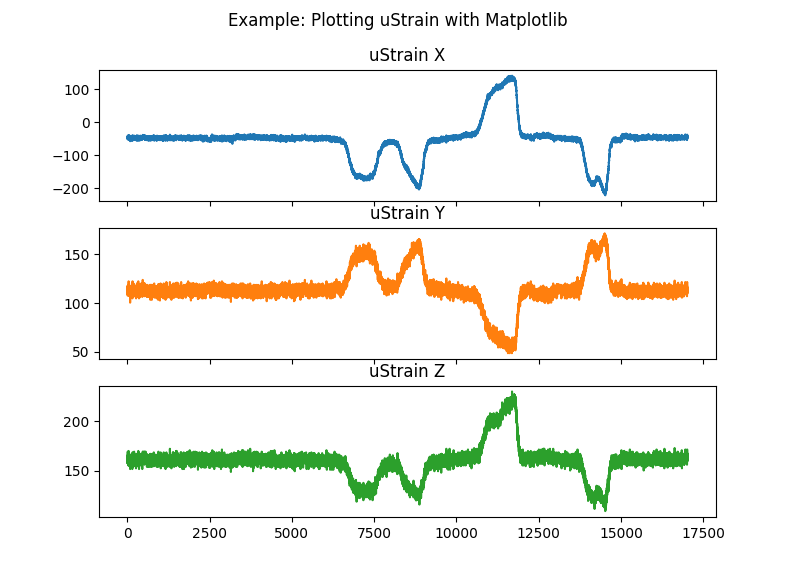

# PyIPR Sensor Lib

Python library for IPR strain sensor.

## Getting Started
The code below can be used as a first example to explore the sensor capabilities. Use the file ```example_02_plot_data_from_file.py``` in the Examples folder to get started.
The first part of the example will create a decoder object and read the binary file provided. The data is parsed into a list of packets ready to be processed. 
```python
# Read the entire file as a single byte string
binary_file_path = "./"
binary_file_name = 'binary_data_example_01.bin'

# Create an object to parse the data from the sensor or a binary file
ipr_obj = IPRSensorDecoder()
telegram_list = ipr_obj.load_from_binary_file(binary_file_path, binary_file_name)
```
The second part of the example will parse each packets if valid, and scale the data to save it in lists.
```python
strain_list = list([list(),list(),list()])
acceleration_list = list([list(),list(),list()])
environment_list = list([list(),list(),list(),list()])
# Analyse each telegram in the list. Each telegram contains either Strain, Acceleration, or Environment data
for _telegram in telegram_list:
    ipr_obj.analyse_packet(_telegram)
    if ipr_obj.ipr_decoder_is_packet_valid():
        if ipr_obj.get_packet_type() == ipr_obj.TYPE_STRAIN:
            strain_list[0].append(ipr_obj.get_strain_xyz(ipr_obj.STRAIN_AXIS_X))    # Get Strain X scaled value
            strain_list[1].append(ipr_obj.get_strain_xyz(ipr_obj.STRAIN_AXIS_Y))    # Get Strain Y scaled value
            strain_list[2].append(ipr_obj.get_strain_xyz(ipr_obj.STRAIN_AXIS_Z))    # Get Strain Z scaled value
        if ipr_obj.get_packet_type() == ipr_obj.TYPE_ACCELERATION:
            acceleration_list[0].append(ipr_obj.get_acceleration_xyz(ipr_obj.ACCEL_AXIS_X))    # Get Acceleration X scaled value
            acceleration_list[1].append(ipr_obj.get_acceleration_xyz(ipr_obj.ACCEL_AXIS_Y))    # Get Acceleration Y scaled value
            acceleration_list[2].append(ipr_obj.get_acceleration_xyz(ipr_obj.ACCEL_AXIS_Z))    # Get Acceleration Z scaled value
        if ipr_obj.get_packet_type() == ipr_obj.TYPE_ENVIRONMENT:
            environment_list[0].append(ipr_obj.get_environment(ipr_obj.ENVIRONMENT_VBAT))  # Get Battery Voltage
            environment_list[1].append(ipr_obj.get_environment(ipr_obj.ENVIRONMENT_PRES))  # Get Pressure
            environment_list[2].append(ipr_obj.get_environment(ipr_obj.ENVIRONMENT_HUMI))  # Get Humidity
            environment_list[3].append(ipr_obj.get_environment(ipr_obj.ENVIRONMENT_TEMP))  # Get Temperature
```
Using Matplotlib, the strain, acceleration, or environment values can be plotted:


<!---
```python
from pyipr_sensor_lib.ipr_sensor_decoder import IPRSensorDecoder
from pyipr_sensor_lib.ipr_serial_interface import IPRSerialInterface

# Create an object for the sensor connected on the serial port
obj = IPRSerialInterface()
obj.serial_setup("COM5")
obj.serial_open()
# Initiate the binary data stream from the sensor
obj.serial_ipr_start_binary_read()

# Create a parser object
ipr_obj = IPRSensorDecoder()
# Read in continuous mode the binary data, parse it and display the converted values
while True:
    ipr_obj.analyse_packet(obj.serial_ipr_read_telegram())
```
Output example:
```
STRAIN X: -2674.73 uStrain ; STRAIN Y: 1030.04 uStrain ; STRAIN Z: 1784.62 uStrain
STRAIN P1: 1410.99 uStrain ; STRAIN P2: 1599.27 uStrain ; STRAIN ANGLE: -42.33 degrees
STRAIN X: 2951.65 uStrain ; STRAIN Y: 1029.30 uStrain ; STRAIN Z: 2347.25 uStrain
STRAIN P1: 1973.63 uStrain ; STRAIN P2: 1599.27 uStrain ; STRAIN ANGLE: -81.71 degrees
STRAIN X: -2674.73 uStrain ; STRAIN Y: 1217.58 uStrain ; STRAIN Z: 2534.80 uStrain
STRAIN P1: 2161.17 uStrain ; STRAIN P2: 1599.27 uStrain ; STRAIN ANGLE: -81.71 degrees
STRAIN X: 2951.65 uStrain ; STRAIN Y: -95.97 uStrain ; STRAIN Z: 1409.52 uStrain
STRAIN P1: 660.81 uStrain ; STRAIN P2: 1599.27 uStrain ; STRAIN ANGLE: 64.57 degrees
ACC. X: 13.48 G ; ACC. Y: -15.02 G ; ACC. Z: -13.01 G
```
-->

### Other functionalities
Get the sensor system status:
```python
print(obj.serial_ipr_get_system_status())
```
Output:
```
Humidty      : 48.0 %
Pressure     : 999.2 HPa
Temperature  : +21.1 C
Battery      : 2.92 V
Material     : MILD-STEEL
Time (RTC)   : 2001-01-01-00-11-17
Firmware Ver : 2.00A
```
## Contributing

Pull requests are welcome. For major changes, please open an issue first to discuss what you would like to change.

Please make sure to update tests as appropriate.

## License

[MIT](https://choosealicense.com/licenses/mit/)
